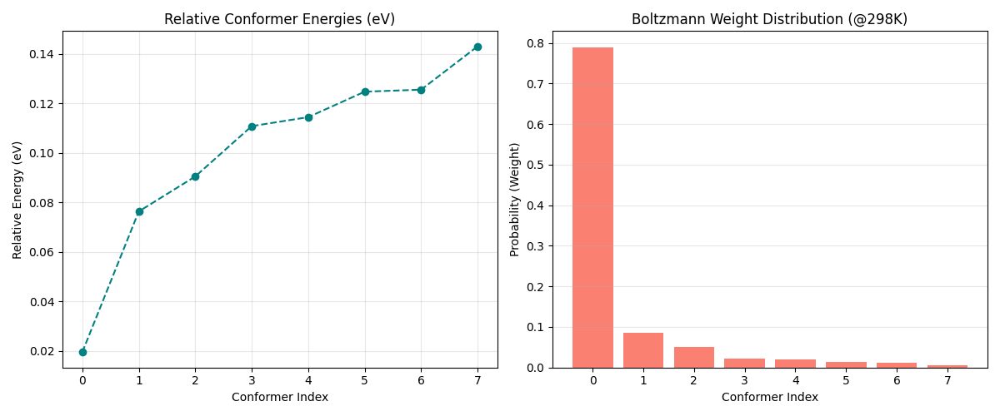

# DeltaChem
**Accelerated Quantum Chemistry via Delta-Learning and Ensemble Averaging.**

## Overview
**DeltaChem** is a high-performance computational framework that delivers quantum-mechanical accuracy at the speed of semi-empirical methods. It uses **$\Delta$-Learning** to predict the correction factor between fast xTB estimates and high-fidelity DFT calculations, enabling rapid analysis of complex molecular ensembles.

## Technical Pipeline


## Mathematical Foundation

### 1. Delta-Learning Theory
Instead of predicting absolute energies, the model learns the residual $\Delta E$ between a low-level (LL) and high-level (HL) method:
$$
\Delta E = E_{HL} (\text{DFT}) - E_{LL} (\text{xTB})
$$
This strategy effectively cancels out systematic errors and focuses the neural network on the complex quantum mechanical interactions.

### 2. Statistical Mechanics (Boltzmann Averaging)
In real-world systems, molecules exist as a distribution of conformers. The probability $w_i$ of conformer $i$ is determined by its relative energy:
$$
w_i = \frac{e^{-\Delta E_i / k_B T}}{\sum_{j=1}^n e^{-\Delta E_j / k_B T}}
$$
The final observable property $\langle P \rangle$ is the weighted average across the ensemble.

## Performance Benchmarks: The "ALCHEMIST" Advantage
We benchmarked the pipeline across three representative molecules to demonstrate the scalability of the speedup factor.

| Molecule | Atoms | ORCA 6 (DFT) | GFN2-xTB | **Speedup Factor** |
| :--- | :---: | :---: | :---: | :---: |
| **Water** (H2O) | 3 | 2.37s | 0.10s | **23.7x** |
| **Caffeine** | 24 | 108.45s | 0.10s | **1084.5x** |
| **Ibuprofen** | 33 | 117.25s | 0.10s | **1172.5x** |

### Visual Proof of Efficiency

*Figure 1: Execution time comparison (log scale). Note how GFN2-xTB remains nearly constant for small molecules while DFT scaling is cubic.*

## Case Study: Caffeine Ensemble Distribution
The ALCHEMIST framework automatically identifies dominant conformers and computes their statistical contribution.

*Figure 2: Relative energies and Boltzmann weights for the Caffeine conformer ensemble at 298K.*

## Key Features
- **Equivariant GNN**: 3D-aware architectures (E(3)-GNN/SchNet) for coordinate-independent prediction.
- **Recursive Recovery**: Automated ORCA input generation with specialized error handling for SCF non-convergence.
- **Production Guardrails**: `CleanupManager` ensures minimal disk footprint during high-throughput runs.
- **Lazy Data Loading**: `h5py` integration for training on datasets exceeding system RAM.

## Getting Started
1. **Environment Setup**:
   ```bash
   pip install -r requirements.txt
   python src/utils/env_check.py
   ```
2. **Run Production Demo**:
   ```bash
   python run_production.py
   ```

## License
MIT License - 2026 Project ALCHEMIST Team
