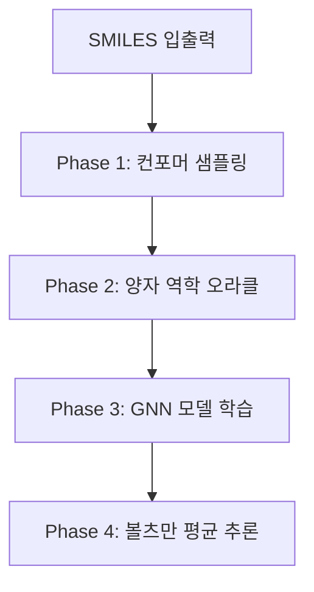

# Project ALCHEMIST: Delta-Ensemble 기술 파이프라인 가이드

본 프로젝트는 양자 역학(DFT)의 높은 정확도와 세미-엠피리컬(xTB)의 빠른 속도를 결합하여, 분자 앙상블의 통계적 속성을 효율적으로 예측하는 **Delta-Learning ($\Delta$-Learning)** 시스템입니다.

## 1. 전역 시스템 아키텍처

본 시스템은 크게 4가지 단계(Phase)로 구성되며, 각 단계는 데이터 생성부터 딥러닝 모델 학습까지 유기적으로 연결됩니다.



---

## 2. 상세 단계별 설명

### Phase 1: 고속 컨포머 샘플링 (High-Throughput Sampling)
*   **목적**: 분자의 3차원 공간상의 다양한 구조(Conformer)를 생성하고 최적화합니다.
*   **기술 스택**: RDKit (ETKDGv3), GFN2-xTB
*   **프로세스**: 
    1.  **SMILES to 3D**: RDKit을 사용해 2D 구조를 3D로 변환합니다.
    2.  **Diversity Filter**: RMSD 기반 필터링을 통해 기하학적으로 중복된 구조를 제거하여 계산 자원을 아낍니다.
    3.  **GFN2-xTB Optimization**: 세미-엠피리컬 수준에서 구조를 빠르게 최적화하고 기초 에너지를 얻습니다.

### Phase 2: 양자 역학 오라클 (The Quantum Oracle)
*   **목적**: AI 학습을 위한 정답(Label)인 DFT 수준의 에너지를 계산합니다.
*   **기술 스택**: ORCA (B3LYP/6-31G*), cclib
*   **프로세스**:
    1.  **Input Generation**: xTB로 최적화된 구조를 ORCA용 입력 파일(`.inp`)로 자동 변환합니다.
    2.  **$\Delta$-Labeling**: $E_{DFT}$와 $E_{xTB}$의 차이($\Delta E$)를 계산합니다. 모델은 이 **보정값**만을 학습하여 복잡한 양자 역학적 오차를 효율적으로 줄입니다.
    3.  **Error Recovery**: 계산 중 발산(SCF non-convergence)이 발생하면 자동으로 `SlowConv` 옵션을 추가하여 재시도합니다.

### Phase 3: 에퀴베리언트 GNN 개발 (Equivariant GNN)
*   **목적**: 3차원 좌표의 회전 및 평행 이동에 불변한 인공지능 모델을 구축합니다.
*   **기술 스택**: PyTorch Geometric, E(3)-Equivariant GNN
*   **주요 특징**:
    1.  **Equivariance**: 분자가 공간상에서 어떤 방향으로 있든 동일한 물리적 화학적 속성을 예측하도록 설계되었습니다.
    2.  **MC-Dropout**: 예측값과 함께 **불확실성(Confidence)**을 제공하여, 모델이 신뢰할 수 없는 데이터를 스스로 판단하게 합니다.

### Phase 4: 볼츠만 가중 평균 (Boltzmann Averaging)
*   **목적**: 여러 컨포머가 섞여 있는 실제 화학 시스템의 속성을 최종 예측합니다.
*   **원리**: 
    - 각 구조의 에너지($\Delta E$)를 기반으로 볼츠만 가중치($w_i$)를 계산합니다.
    - $w_i = \exp(-\Delta E_i / kT) / \sum \exp(-\Delta E_j / kT)$
    - 가중치가 높은(안정적인) 구조의 속성을 더 많이 반영하여 실제와 가까운 성질(HOMO-LUMO Gap, 쌍극자 모멘트 등)을 산출합니다.

---

## 3. 리소스 관리 (Guardrails)
본 프로젝트는 연구실의 자원을 보호하기 위해 다음과 같은 기능을 탑재하고 있습니다:
*   **CleanupManager**: ORCA가 생성하는 대용량 임시 파일(`.gbw`, `.tmp`)을 추출 직후 즉시 삭제합니다.
*   **Lazy Loading**: `h5py`를 통해 수만 개의 데이터를 메모리에 올리지 않고 필요할 때만 불러와 VRAM 8GB 이하에서도 동작 가능하게 합니다.
```
